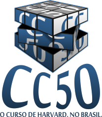

## Soluções para os set's de problemas do CC50/CS50.
> CC50 é uma adaptação em português do curso CS50 de Harvard.

  

“Exigente, mas definitivamente possível de ser feito. Social, mas educacional. Um tópico focado nas habilidades amplamente aplicáveis. CS50 é o curso de Harvard por excelência, e CC50 é a adaptação gratuita desse curso no Brasil.”

#### Sobre
Introdução às faculdades intelectuais da ciência da computação e à arte da programação. Este curso ensina os alunos a pensar algoritmicamente e resolver problemas de forma eficiente. Os tópicos incluem:
- abstração,
- encapsulamento,
- estruturas de dados,
- bancos de dados,
- gerenciamento de memória,
- desenvolvimento de software,
- virtualização,
- e websites.

Linguagens incluem:
- C,
- PHP,
- JavaScript,
- SQL plus,
- CSS,
- e XHTML.

Sets de Problemas inspirados no mundo real: domínios da biologia, criptografia, finanças, ciência forense, e jogos. Projetado para todos os interessados, com ou sem experiência anterior em programação.

#### Links
- [CC50 em português](https://cc50.com.br)
- [CS50 original](https://www.cs50.net)

#### Observação
- Não fiz o último pset porque precisa de uma biblioteca do Google Earth descontinuada.
